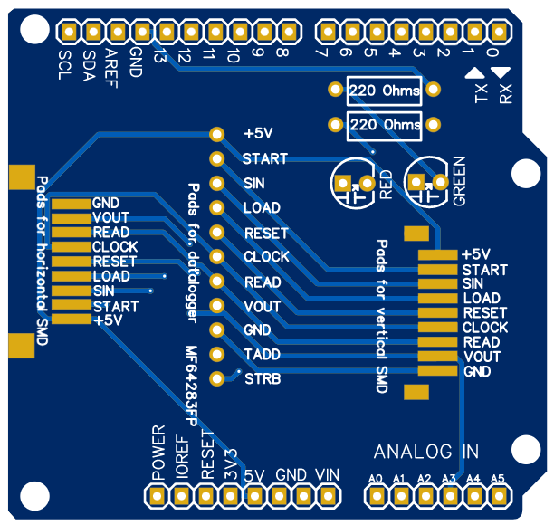

## Play-with-the-Game-Boy-Camera-Mitsubishi-M64282FP-sensor

**A set of codes to bitbang the Mitsubishi M64282FP artificial retina with a simple Arduino Uno**

**Note 2023: despite being simple to build and funny to use the fancier [Raspberry Pi Pico version](https://github.com/Raphael-Boichot/Mitsubishi-M64282FP-dashcam) may be prefered now.**

There has been many previous attempts to interface this sensor out of a Game Boy Camera. The most famous is an [AVR/Arduino port](https://github.com/shimniok/avr-gameboy-cam) which have been coupled with a [java interface](https://www.bot-thoughts.com/2010/04/gameboy-camera-prototyping.html) or a [TI Calculator](https://www.cemetech.net/projects/item.php?id=54). However, these projects use the same C code originating from the old [initial 2005 project](http://sophiateam.undrgnd.free.fr/microcontroller/camera/).

The project here is a reboot/cleaning of the initial AVR code with Arduino IDE compatible commands and a basic autoexposure loop that allows the device to run autonomously with registers close to the ones of Game Boy Camera. A Matlab serial sniffer is also provided but any other way of reading the serial port to get the image pixel data may be use.

Required installations: [Arduino IDE](https://www.arduino.cc/en/software).

Simply grab the eye ball of a Game Boy camera, connect to an Arduino Uno following the pinout (harvest or buy a JST ZH1.5MM 9 Pin connector for a conservative approach, or use [this tiny breakout board](https://github.com/Raphael-Boichot/Mitsubishi-M64282FP-dashcam/tree/main/PCB/128x160_PCB%20and%20schematic/Sensor%20to%20PCB%20adapter%20board)) or this [full PCB for Arduino Uno](/PCB), upload the code to the board, run the Matlab code and enjoy your pixelated images in the ./images/ folder ! You can add a LED to D4 to see exposure delay. The sensor natively outputs 128x128 pixels images but the 5 lower lines of pixels return calibration data (the pixels [are physically masked](https://github.com/Raphael-Boichot/Game-Boy-chips-decapping-project), see next chapter).

Reader may read with interest the [user manual of the M64283FP](https://github.com/Raphael-Boichot/Play-with-the-Game-Boy-Camera-Mitsubishi-M64282FP-sensor/blob/main/Additionnal%20informations/Mitsubishi%20Integrated%20Circuit%20M64283FP%20Image%20Sensor.pdf), another sensor of the series, which is much more detailed about what is the function of the M64282FP masked pixels area (called "dark pixels column"). This is basically an area of obfuscated pixels on purpose. The manual indicates how to modify the registers practically from the signal extracted with these pixels (see the dark level calibration section). It is not mandatory to perform such tuning practically, as you can just post-process the digital pixel data.

**EDIT 2024: masked pixels of the M64282FP sensor always returns the maximal possible voltage at saturation contrary to the masked pixels of the M64283FP which really return voltage in the dark. Whatever their purpose, masked pixels of the M64282FP sensor cannot be used to calibrate signal the same way as the M64283FP does.**

## Exemple of normal pixel and dark pixel on the sensor

High resolution images of the Game Boy Camera sensor and details of the pixels can be found [here](https://github.com/Raphael-Boichot/Game-Boy-chips-decapping-project).

## Pinout and setup

The pinout given here is the same than in the Arduino program. I'm not particularly proud of my setting but it does the job for the time of code developpement. Using [the dedicated PCB and BOM](/PCB) is strongly advised.

## Dedicated PCB for Arduino Uno

## Example of image output

You can notice that 2D edge enhancement (on the right) reveals image artifacts (vertical streaks and horizontal splitting of image exposure) well known from the Game Boy Camera freaks. In consequence, these artifacts are intrinsic to the M64282FP sensor and not a bug into the Game Boy Camera code implementation. I weared the same black jacket on the two images and you can see the infrared fluorescence on the left one (with outdoor ligth), the sensor being particularly sensitive to it.

## Example of image output with lens modification

The sensor resolution is high enough to perform convincing astrophotography. Used at the back of a film camera, the crop factor is approximately x10, wich means that the equivalent focal lenght is multiplied by 10. On the right image of the moon, the lens is 300 mm for a 24x36 mm film, which corresponds to 3000 mm for the tiny Mitsubishi sensor.

## Example of image artifacts

Vertical and horizontal artifacts seen on the Game Boy Camera are just a matter of exposure level and are intrinsic to the sensor. They are increased by the edge enhancement feature and are always more or less present (for certain exposure settings both vertical and horizontal artifacts are even present). Anyway, the image quality is remarquable seing the sensor resolution and the crap plastic lens used with it. Edge enhancement globally improves the quality of image.

## Known limitations and perspectives
As explained, the whole process to display an image is sluggish as hell due to the ADC (Analog-to-Digital Converter) of Arduino which uses a successive approximation method. I've tried to use the [Analog read fast library](https://github.com/avandalen/avdweb_AnalogReadFast), which for sure increases the refresh rate (by a factor of 2 approximately), but renders the code incompatible with ESP8266/ESP32.

The Arduino Uno is anyway not fast enough to bitbang the sensor at its optimal frequency of 1 MHz, which means that the exposure registers leads to exposure time much longer (about 4 times) than expected. Cool consequence: it behaves particularly well at night, bad consequence, it's impossible to take pictures in full daylight without neutral filter.

## Concluding remarks and some dive into the Game Boy Camera exposure strategy.
I've made some datalogging of the registers sent by a Game Boy Camera to the sensor. There are 3 main phases where the camera sends registers to the sensor:
- **At boot**: to verify if the sensor is connected: [registers sent during boot sequence](https://github.com/Raphael-Boichot/Play-with-the-Game-Boy-Camera-Mitsubishi-M64282FP-sensor/blob/main/Research%20on%20real%20Camera/Boot.pdf). It probably just looks for receiving something other than full black image as the camera is not able to physically probe whether the sensor is electrically connected to the [MAC-GBD](https://niwanetwork.org/wiki/GBD_(Game_Boy_mapper)) or not, apart by trying to receive non-zero data on VOUT line.
- **When in use to take photos**: the camera basically varies the output reference voltage (register O), the gain (register (G) and the exposure time (register C) to maximize image dynamic range within a fixed voltage range (of about 1.5-3.3 volts). Gain and output reference voltage are just pre-sets function of exposure time. Output reference voltages used are probably tuned during the **sensor calibration** (see next). To find the correct exposure, the camera calculates exposure time for the next displayed image by "multiplying" the current exposure time by a fixed value (1-1/4, 1-1/8, 1-1/16, 1-1/32, 1-1/64 "multiplier" on exposure time for over-exposed images, 1+1/8, 1+1/16, 1+1/32, 1+1/64 "multiplier" on exposure time for under-exposed images). The bigger the difference of image brighness to a desired reference value, the farther from 1 is the "multiplier". The camera probably uses a sum to assess brighness (and calculate an error), for example the sum of bits in odd bytes and the sum of bits/2 in even bytes of a given image encoded in Game Boy Tile Format is a good descriptor for its brighness (GBTD is what returns the MAC-GBD). As this calculation is slow as shit for a Game Boy, it needs a lookup table: it is present at range 0x02B300-0x02B3FF of the international rom (filling this table with 0x00 leads to a camera that cannot adjust time exposure correctly). Here an example of registers sent in case of [very strong light variation](https://github.com/Raphael-Boichot/Play-with-the-Game-Boy-Camera-Mitsubishi-M64282FP-sensor/blob/main/Research%20on%20real%20Camera/Violent_exposure_change.pdf) and in [normal use](https://github.com/Raphael-Boichot/Play-with-the-Game-Boy-Camera-Mitsubishi-M64282FP-sensor/blob/main/Research%20on%20real%20Camera/Normal_use.pdf).
- **During sensor calibration**: this calibration is triggered by [following the procedure here](https://github.com/Raphael-Boichot/Inject-pictures-in-your-Game-Boy-Camera-saves#part-3-calibrating-the-sensor) and must be made in complete dark. The exact registers modified by this calibration are unknown (it stores new data in sram at range 0x04FF2-0x04FFF, echoed at the range 0x11FF2-0x011FFF, that are not obvious registers) but it probably calculates a table of "ideal" output reference voltages to use during the autoexposure strategy. Example of registers sent to the sensor during calibration can be found [here](https://github.com/Raphael-Boichot/Play-with-the-Game-Boy-Camera-Mitsubishi-M64282FP-sensor/blob/main/Research%20on%20real%20Camera/Factory_reset.pdf).

In any case, P, M and X registers are always 0x01, 0x00 and 0x01. These registers cannot be changed by the Game Boy Camera itself and are imposed by the MAC-GBD directly (this explains why the MAC-GBD can only take 5 bytes of registers and the sensor 8 bytes). Exposure strategies mimicking the real Game Boy Camera (as well as a description of all registers) are integrated into these two camera homebrew projects: [2bit PXLR Studio](https://github.com/HerrZatacke/2bit-pxlr-studio) and [Photo!](https://github.com/untoxa/gb-photo)

## Regrettable attempt to make a camera device with an ESP32
I attempted to make a fully automated device to turn the sensor into a dashcam [with an ESP32](https://github.com/Raphael-Boichot/Play-with-the-Game-Boy-Camera-Mitsubishi-M64282FP-sensor/tree/main/ESP32_version_beta). Well, it kind of "worked" but the project very suffered from the poor performances of the Arduino IDE ESP library I used, despite the good theoretical properties of ESPs according to Espressif... So the project comes with a working code allowing you to build a 0.2 fps dashcam saving images in BMP on SD card. It can surely be improved but I prefered [moving on a Raspberry Pi Pico](https://github.com/Raphael-Boichot/Mitsubishi-M64282FP-dashcam) rather than continue to try something on this piece of crap of ill-documented hardware.

## Acknowledgments
- [Andreas Hahn](https://github.com/HerrZatacke) for Excel spreadsheet and fruitfull discussions;
- [Antonio Niño Díaz](https://github.com/AntonioND) for the deep sensor analysis;
- [Michael Shimniok](https://github.com/shimniok) for the source code I started from;

